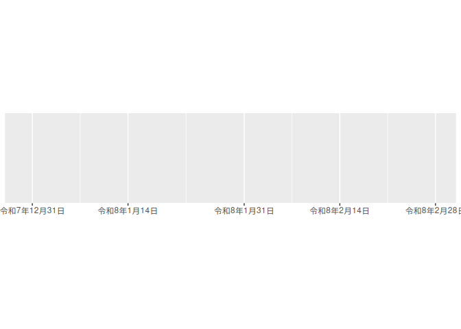

<!-- README.md is generated from README.Rmd. Please edit that file -->

# audubon <a href='https://paithiov909.github.io/audubon/'></a>

<!-- badges: start -->

[](https://paithiov909.r-universe.dev)
[](https://github.com/paithiov909/audubon/actions)
[](https://app.codecov.io/gh/paithiov909/audubon)
[](https://cran.r-project.org/package=audubon)
<!-- badges: end -->

audubon is Japanese text processing tools for:

- hiraganization, katakanization and romanization with
  [hakatashi/japanese.js](https://github.com/hakatashi/japanese.js)
- segmentation by phrase with
  [google/budoux](https://github.com/google/budoux) and
  ‘TinySegmenter.js’
- text normalization which is based on rules for the ‘Sudachi’
  morphological analyzer and the ‘NEologd’ (Neologism dictionary for
  ‘MeCab’)

## Installation

``` r
remotes::install_github("paithiov909/audubon")
```

## Usage

### Japanese text normalization

`strj_normalize` normalizes text following the rule based on
[NEologd](https://github.com/neologd/mecab-ipadic-neologd/wiki/Regexp.ja)
style.

``` r
strj_normalize("――南アルプスの　天然水-　Ｓｐａｒｋｉｎｇ*　Ｌｅｍｏｎ+　レモン一絞り")
#> [1] "ー南アルプスの天然水-Sparking* Lemon+レモン一絞り"
```

`strj_rewrite_as_def` is an R port of
[SudachiCharNormalizer](https://gist.github.com/sorami/bde9d441a147e0fc2e6e5fdd83f4f770)
that typically normalizes characters following a ’\*.def’ file.

audubon package contains several ’\*.def’ files, so you can use them or
write a ‘rewrite.def’ file by yourself as follows.

    # single characters will **never** be normalized.
    …
    # if two characters are separated with a tab,
    # left side forms are always rewritten to right side forms
    # before normalized.
    斎   斉
    齋   斉
    齊   斉
    # supports rewriting a single character to a single character,
    # i.e., this cannot work.
    ｱｯ  ア

This feature is more powerful than `stringi::stri_trans_*` because it
allows users to control which characters are normalized. For instance,
this function can be used to convert *kyuji-tai* characters to
*shinji-tai* characters.

``` r
stringi::stri_trans_nfkc("Ⅹⅳ")
#> [1] "Xiv"
strj_rewrite_as_def("Ⅹⅳ")
#> [1] "Ⅹⅳ"
strj_rewrite_as_def("惡と假面のルール", read_rewrite_def(system.file("def/kyuji.def", package = "audubon")))
#> [1] "悪と仮面のルール"
```

### Japanese label helpers for ggplot2

audubon provides small helper functions designed to work with ggplot2
labellers, making it easier to format Japanese text and dates in plots.
These labellers are intended for cases where default wrapping or
formatting is insufficient for Japanese text, and where ICU-based locale
handling can be leveraged without manual preprocessing.

#### Japanese word wrapping

`label_wrap_jp()` and `label_wrap_jp_gen()` wrap labels at natural
Japanese phrase boundaries rather than fixed character widths. This is
useful for discrete scales with long Japanese labels, such as titles,
phrases, or excerpts.

``` r
scales::demo_discrete(polano[4:6], labels = label_wrap_jp_gen())
#> scale_x_discrete(labels = label_wrap_jp_gen())
```


#### Japanese date labels

`label_date_jp()` and `label_date_jp_gen()` format date labels using the
Japanese calendar system, including era-based representations. They can
be used with date or datetime scales to produce locale-aware Japanese
date labels without manual formatting.

``` r
date_range <- function(start, days) {
  start <- as.POSIXct(start)
  c(start, start + days * 24 * 60 * 60)
}
two_months <- date_range("2025-12-31", 60)
scales::demo_datetime(two_months, labels = label_date_jp_gen())
#> scale_x_datetime(labels = label_date_jp_gen())
```



## License

© 2025 Akiru Kato

Licensed under the [Apache License, Version
2.0](https://www.apache.org/licenses/LICENSE-2.0.html).

Icons made by iconixar from flaticon.
